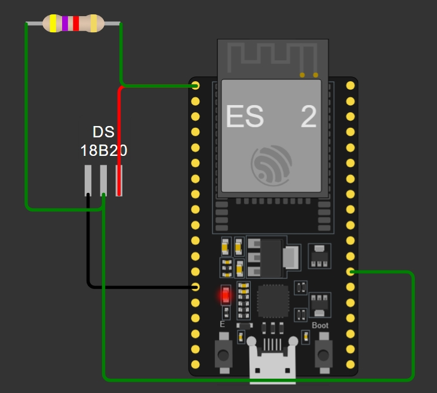
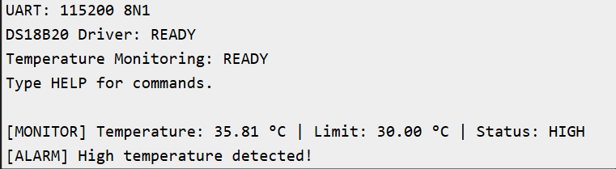

# Sensor Interface and Communication System

Run in wokwi: https://wokwi.com/projects/472495675382144001

## Overview

An embedded temperature monitoring system developed using ESP32 and a DS18B20 digital temperature sensor.

The system demonstrates sensor interfacing, driver abstraction, UART communication, command processing, configurable temperature thresholds, automatic monitoring, and error handling.

## Hardware / Simulation

- ESP32
- DS18B20 temperature sensor
- 4.7 kΩ pull-up resistor
- Wokwi simulator

### Wokwi Circuit

### Simulation Output

## Communication

### Sensor Interface

- Protocol: 1-Wire
- GPIO: GPIO 4
- Supply: 3.3 V

### UART

- Baud rate: 115200
- Data bits: 8
- Parity: None
- Stop bits: 1

## Features

- Read temperature from DS18B20
- Automatic temperature monitoring
- Sensor connection detection
- Configurable high-temperature threshold
- UART command interface
- High-temperature alarm
- Modular driver architecture
- Error handling
- Non-blocking monitoring using `millis()`

## UART Commands

| Command | Description |
|---|---|
| `TEMP` | Read current temperature |
| `STATUS` | Check sensor connection |
| `GETLIMIT` | Display temperature limit |
| `SETLIMIT X` | Change temperature limit |
| `HELP` | Display available commands |

### Example

Command:

SETLIMIT 20

Response:

Temperature limit set to: 20.00 °C

## Software Architecture

                    Application
                         |
             +-----------+-----------+
             |                       |
      DS18B20 Driver            UART Interface
             |                       |
         OneWire                 Serial/UART
             |                       |
          DS18B20                    PC

The DS18B20 driver uses the OneWire and DallasTemperature libraries.
The project uses a modular architecture where the application communicates with the sensor through a dedicated DS18B20 driver and communicates with the user through a UART interface.

## Project Structure

Sensor-Interface-Communication-System/
│
├── sketch.ino
├── ds18b20_driver.h
├── ds18b20_driver.cpp
├── uart_interface.h
├── uart_interface.cpp
├── diagram.json
├── libraries.txt
└── README.md

## Sensor Wiring

ESP32                DS18B20

3.3V  -------------- VCC
GND   -------------- GND
GPIO4 --------------- DQ
                       |
                    4.7 kΩ
                       |
                      3.3V

The 4.7 kΩ resistor is used as the pull-up resistor on the 1-Wire data line.

## Monitoring

The system automatically checks the temperature every 2 seconds.

Example:

[MONITOR] Temperature: 22.00 °C | Limit: 30.00 °C | Status: NORMAL

When the temperature reaches or exceeds the configured limit:

[MONITOR] Temperature: 22.00 °C | Limit: 20.00 °C | Status: HIGH
[ALARM] High temperature detected!

## Error Handling

The system detects a disconnected DS18B20 sensor.

Example:

[MONITOR] ERROR: DS18B20 disconnected!

The UART command interface also reports unknown commands:

ERROR: Unknown command
Type HELP for available commands.

## Testing

The following functions were successfully tested in the Wokwi simulator:

- DS18B20 temperature acquisition
- 1-Wire sensor communication
- UART communication
- UART command processing
- Sensor status detection
- Temperature threshold configuration
- High-temperature alarm
- Automatic periodic monitoring
- Invalid temperature limit handling
- Unknown UART command handling

## Technologies Used

- C++
- ESP32
- DS18B20
- 1-Wire protocol
- UART
- Wokwi
- Embedded driver architecture

## Future Improvements

- Add I2C sensor support
- Add SPI communication
- Add non-volatile configuration storage
- Add CRC/error validation
- Add unit tests
- Add logging
- Add additional sensor types
- Port the driver to another microcontroller
- Add automated test scripts

## Project Status

Completed and tested successfully in the Wokwi simulator.

The project demonstrates practical embedded-system concepts including sensor interfacing, driver abstraction, UART communication, command processing, periodic monitoring, configuration, and error handling.
